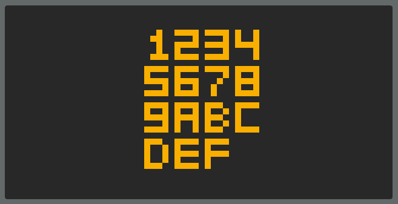

# Chippy
A Chip-8 Emulator written in javascript

[Live DEMO](https://slurrps-mcgee.github.io/Chippy/)

# Features
* Display Controls
* CPU Controls
* Sound Controls
* Rom Selection

# Debug Features
* Register Display

# Features TODO
* Implement instruction log to the left
* Hex Dump
* Save State
* Anti Flickering
* Virtual Keypad

# Bugs
* sound issue that pops up with blinky sometimes when hitting a wall

### KEYMAP
KEYPAD - KEYBOARD
- 123C <- 1234
- 456D <- QWER
- 789E <- ASDF
- A0BF <- ZXCV
